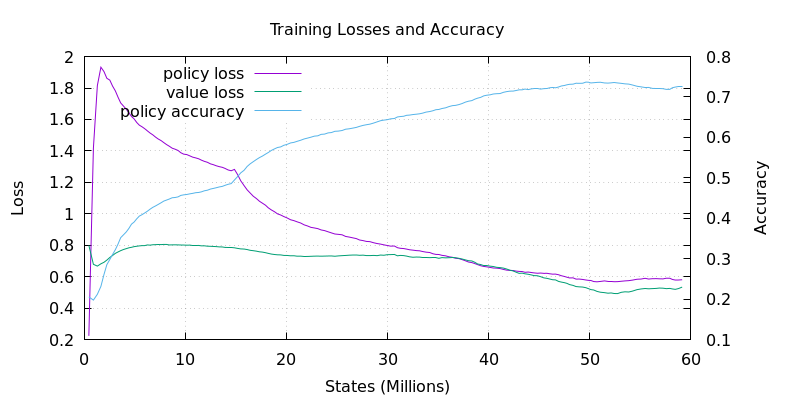
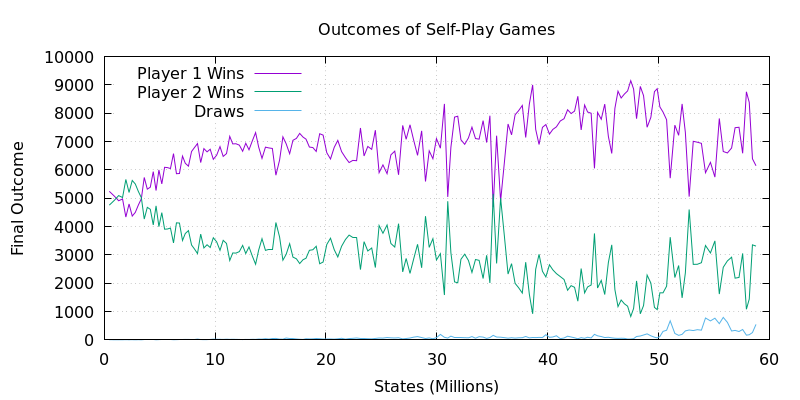
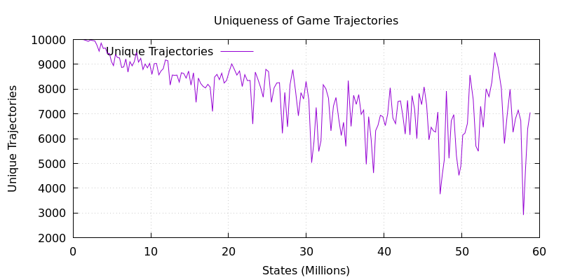
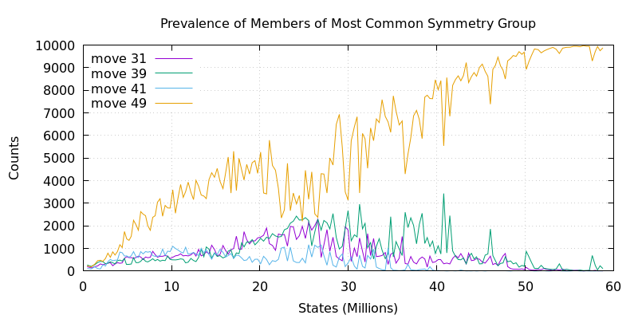
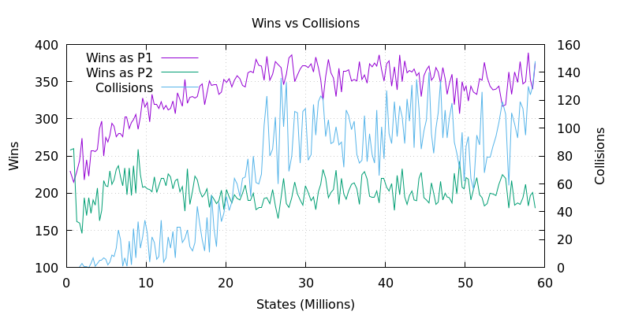
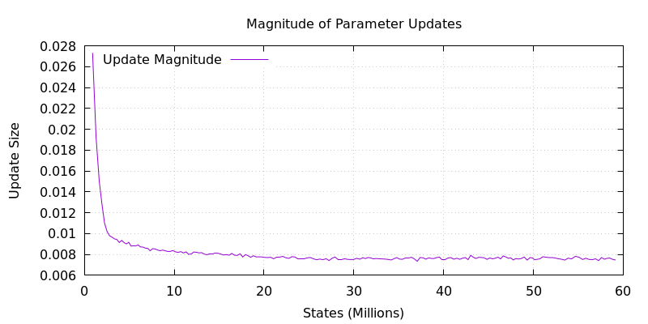

# RL Dashboards

This repository hosts reinforcement learning dashboards for a custom implementation of Gumbel AlphaZero that I'm applying to 9x9 Gomoku with SGD (I'm experimenting with optimisers).

---

## Training Progress

**Self-Play Elo**  

Simple self-play elo.
1. Initially, the Goats only consists of a random player
2. Each model checkpoint plays against all the Goats (floating Elo)
3. Checkpoints exceeding max(goats_elo)+100 get added to the Goats
4. Other experiments, trained in isolation, must face these baseline Goats

This is how I do evaluation.

**Training Metrics**  

Measure training metrics. I started recording this a little late.

---

## Game Metrics

**Game Length**  

Reflects development of strategy over time. Really interesting in combination with other charts.

**Game Outcome**  

Surprisingly dynamic. Player 1 learns a cheese, Player 2 learns a counter, etc etc.

**Value Estimate at Opening Move**

Looks like Player 1 got a little cocky off some early success :j

**Compressibility of Trajectories**  

How compressible are my model's strategies?
1. Concatenate a batch of games (batch is 10,000 in my 9x9 Gomoku experiments)
2. Compress with gzip and report compressed size.

There seemed to be a lack of diversity of games around 30 million states.

**Uniqueness of Trajectories**  

How many unique games are being played in each batch. Is my model collapsing? Can it recover?

---

## Symmetry

**Discovery of Symmetry Groups**  

Displaying the opening moves corresponding to the most common symmetry group
1. Map moves to symmetry groups
2. Identify the most common symmetry group
3. Display counts of opening moves that correspond to the most common symmetry group

Goal is to determine at what point the model becomes aware that the domain is symmetrical.

**Duplication in n-Ply Game-Opening Sequences**  

Counting unique n-ply opening sequences across time. We can see the model becoming very opinionated about sequences of moves over time. From thousands of unique sequences to a few hundred.

**Symmetry-Aware Deduplication in n-Ply Game-Opening Sequences**  

- Ratio of unique_symmetry_aware_fingerprints / unique_fingerprints.
- Ratio of 1 indicates no symmetries are being played.
- Ratio of 1/8 (in this case) indicates all symmetries are played for all unique sequences.

Lower bound is 1/8 in this case because of interaction between rotational and reflectional symmetry modes.

---

## Evaluation Metrics

**Performance in Evaluation Games**  

1000 evaluation games are played by policy-only sampling with an annealed temperature (starting at 1.0, halflife of 10 moves.)

**Error in End-Game Value Estimate**

Model kinda knows who's about to win, but in games like this it's tricky because the game ends suddenly. Something that complicates these estimates further is the fact that I'm using Gumbel action selection from the Gumbel MuZero paper, but I've set n=m=8 which is a very small number of actions sampled, and m=n disables lookahead. So this is basically PPO at this point.

**Parameter Updates**  

Magnitude of parameter updates at different points in training.

**Policy Entropy**  

Entropy of policy at different depths in the game stack.

---

_All plots are automatically updated as training progresses._
