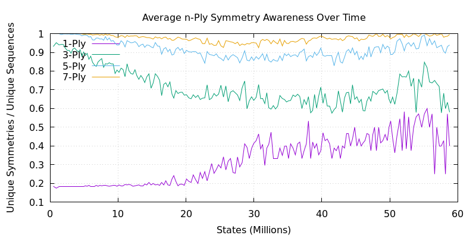
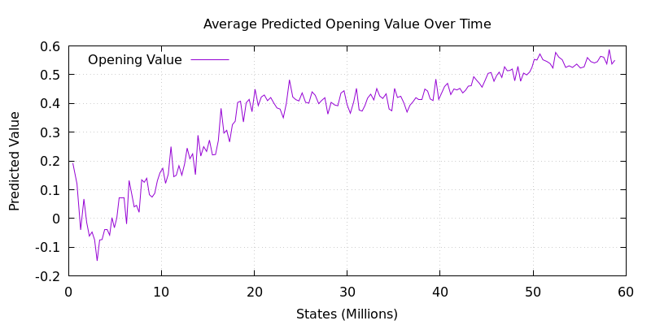

# RL Dashboards

This repository hosts reinforcement learning dashboards for a custom implementation of Gumbel AlphaZero that I'm applying to 9x9 Gomoku with SGD (I'm experimenting with optimisers).

---

## Training Progress

**Self-Play Elo**  

Simple self-play elo. This is the first run in the experiment. Subsequent runs will have different configurations and will (obviously) learn through self-play, completely in isolation, but will be evaluated against these baseline models so I can have a little measuring stick!

**Training Metrics**  

Little late to start recording these losses, so there's a bunch missing from the beginning of the run.

---

## Game Metrics

**Game Length**  

Reflects development of strategy over time. Really interesting in combination with other charts.

**Game Outcome**  

Surprisingly dynamic. Player 1 learns a cheese, Player 2 learns a counter, etc etc.

**Duplication in n-Ply Game-Opening Sequences**  

Counting unique n-ply opening sequences across time. We can see the model becoming very opinionated about sequences of moves over time. From thousands of unique sequences to a few hundred.

**Symmetry-Aware Deduplication in n-Ply Game-Opening Sequences**  

- Ratio of unique_symmetry_aware_fingerprints / unique_fingerprints.
- Ratio of 1 indicates no symmetries are being played.
- Ratio of 1/8 (in this case) indicates all symmetries are played for all unique sequences.

Lower bound is 1/8 in this case because of interaction between rotational and reflectional symmetry modes.

---

## Model Behavior

**Value Estimate at Opening Move**

Looks like Player 1 got a little cocky off some early success :j

**Error in End-Game Value Estimate**

Model kinda knows who's about to win, but in games like this it's tricky because the game ends suddenly. Something that complicates these estimates further is the fact that I'm using Gumbel action selection from the Gumbel MuZero paper, but I've set n=m=8 which is a very small number of actions sampled, and m=n disables lookahead. So this is basically PPO at this point.

---

## Evaluation Metrics

**Performance in Evaluation Games**  

1000 evaluation games are played by policy-only sampling with an annealed temperature (starting at 1.0, halflife of 10 moves.)

**Game Compressibility vs Overall Uniqueness**  
<!--  -->
coming soon

---

_All plots are automatically updated as training progresses._
