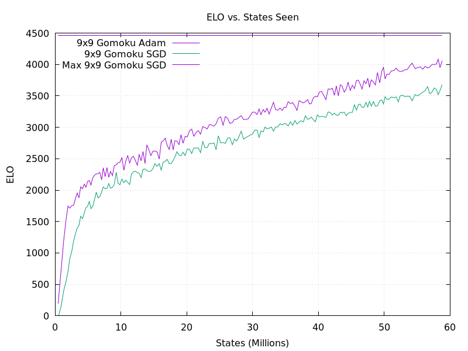
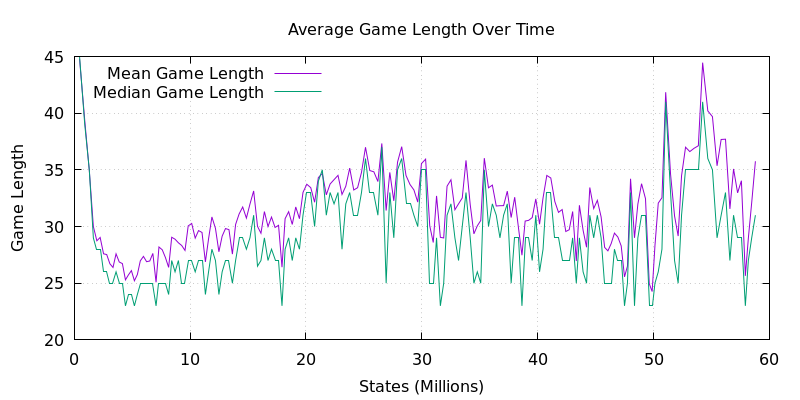
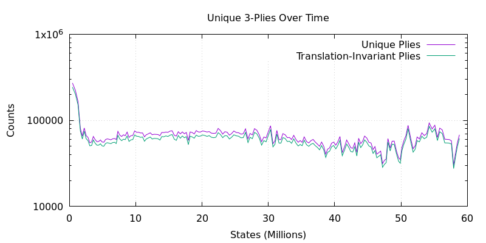
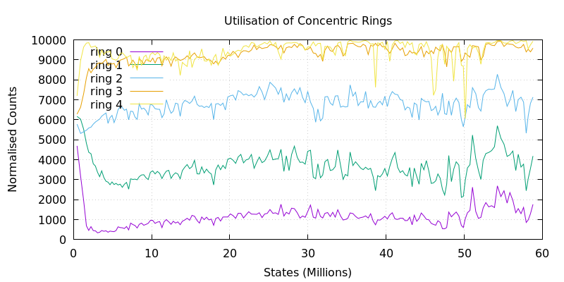
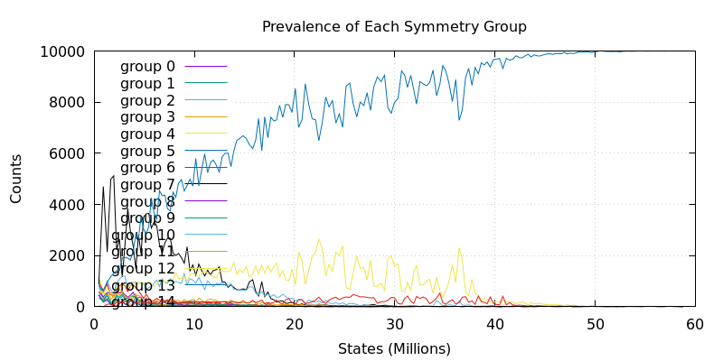
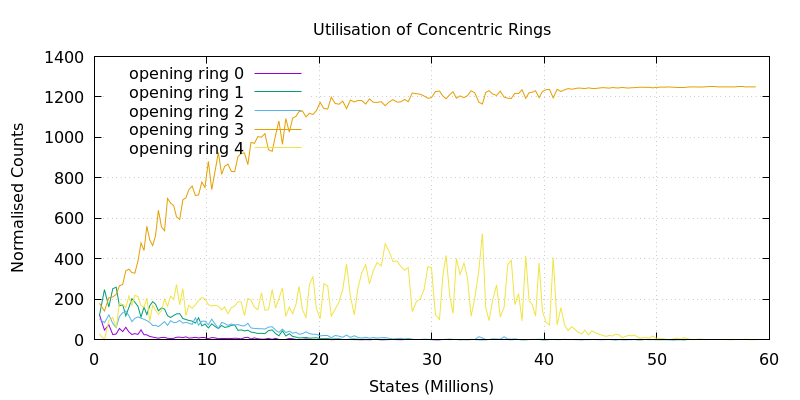
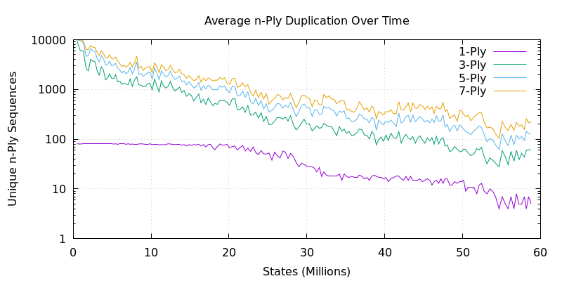

# RL Dashboards

This repository hosts reinforcement learning dashboards for a custom implementation of Gumbel AlphaZero that I'm applying to 9x9 Gomoku with SGD (I'm experimenting with optimisers).

---

## Training Progress

**Self-Play Elo**  

**Training Metrics**  

---

## Game Metrics

**Game Length**  

**Game Outcome**  

**Variety in Self-Play**  

**Stone Mass (in Concentric Rings)**

---

## Opening Move

**Opening Move by Symmetry Group**

**Opening Moves in Most Common Symmetry Group**

**Opening Moves Played in Concentric Rings**  

---

## More on Symmetry

**Duplication in n-Ply Game-Opening Sequences**  

**Ratio of Symmetries in Opening Sequences**

---

## Model Evaluation

**Performance in Evaluation Games**  

**Parameter Updates**  

**Policy Entropy**  

---

## Performance

**Pipeline Performance**  

---

_All plots are automatically updated as training progresses._
